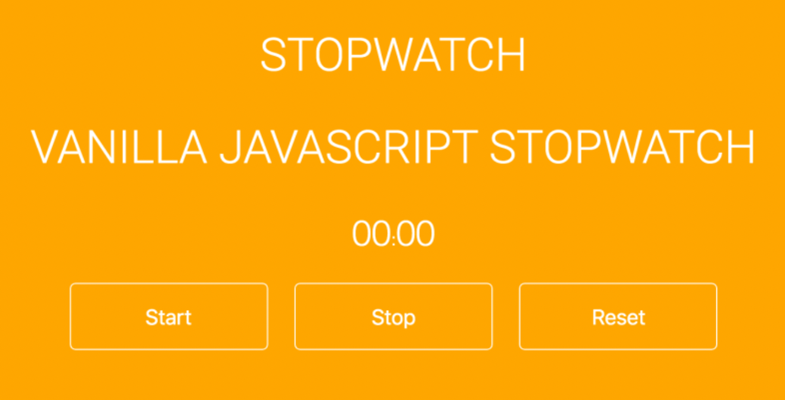

# Stop Watch

## 구현 기능

1. start button
2. stop button
3. reset button
4. 화면에 시간이 보여야 함
5. css는 자유롭게

## Extra

1. git 사용해 보기 (ex. github, gitlab)
2. github page or netlify 배포 (이거는 어려울수 있으니 조사만 해도 좋을듯)

## 개발환경 세팅

1. terminal 열기
2. `npm install` 명령어 실행
3. `npm run dev` 명령어 실행해서 develpment 모드로 개발 시작
4. 크롬 브라우저에서 `http://localhost:3000/` 열어서 개발 시작

## 공부하면 좋은 것들

- what is `.gitignore`?
- what is `pacakge.json`?
- what is `npm`?
- what is `node_modules` file?
- what is `.dist` file?
- what is module bundler?
